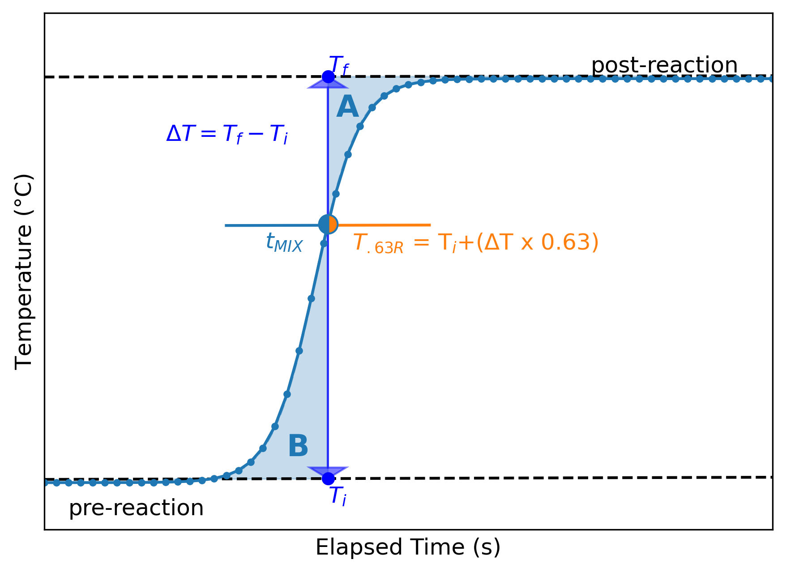
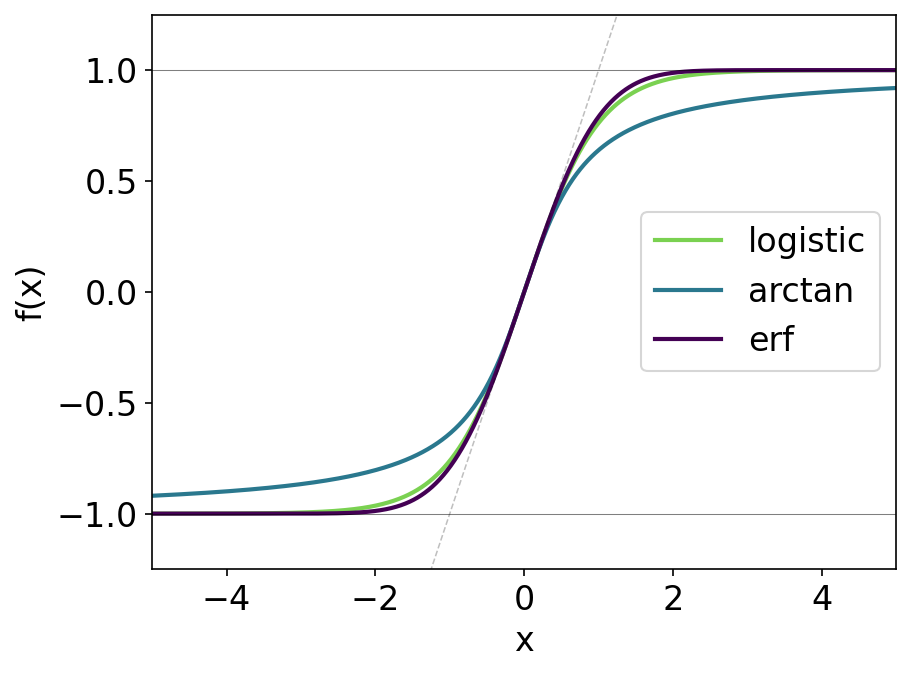
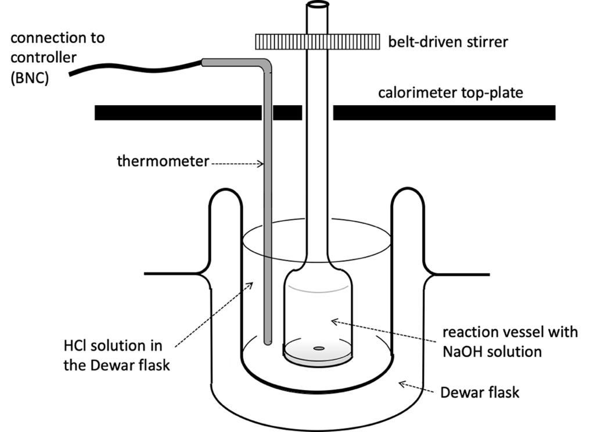

# SOLUTION CALORIMETRY: HEAT OF NEUTRALIZATION

> [!NOTE]
> Enthalpy
> 
> Calorimetry
> 
> Curve fitting
> 
> Python functions

## Introduction to Calorimetry

Thermodynamics is the study of how a system exchanges energy with its surroundings. These interactions in an isolated system follow the First Law of Thermodynamics which can be stated succinctly as 

$$
\Delta U_\text{sys}+\Delta U_\text{SURR}=0
$$

 For describing chemical reactions in aqueous media at constant pressure, $\Delta H$ is the preferred metric for understanding the amount of heat exchanged between system and surroundings.

$$
\begin{align}
\Delta H&=\Delta U+p\Delta V \\
\Delta H&=(q-p\Delta V)+p\Delta V \\
\Delta H&=q_p \end{align}
$$

Therefore, at constant pressure, Equation [2.1](#Eq2-1-FirstLaw) may be re-written as

$$
q_\text{sys}+q_\text{SURR}=0
$$

Equation [2.5](#Eq2-5-qsys) is the basis for understanding the technique known as calorimetry. The system a chemical reaction proceeding in isolated environment where the temperature response of the surroundings (aqueous solution and the calorimeter) may be monitored. For exothermic chemical reactions, the amount of heat given up by the system (chemical reaction) equals the amount of heat gained by the surroundings.

$$
q_\text{sys}= -q_\text{SURR}
$$

In calorimetry experiments, $q_\text{SURR}$ is the amount of heat required to effect a measurable physical change in the calorimeter (i.e. a change in temperature). The amount of heat gained by the surroundings is quantified by a known calorimeter constant, $C_\text{CAL}$, and the change in temperature, $\Delta T$.

$$
q_\text{sys}=-C_\text{CAL}\times\Delta T
$$

In this experiment to determine $\Delta H_\text{neut}$, the surroundings are the calorimeter structure and aqueous solution that is the medium for the chemical reaction. $C_\text{CAL}$ is unique for each calorimeter. For the Parr 1455 Solution Calorimeter that is used in this lab, $C_\text{CAL}$ is given by Equation [2.8](#Eq2-8-Ccal).

$$
C_\text{CAL} \bigg(\dfrac{J}{\degree C}\bigg)=\bigg[89.44\bigg(\dfrac{J}{\degree C}\bigg)\bigg]+\bigg[4.184\bigg(\dfrac{J}{g\degree C}\bigg)\times m_{soln} (g)\bigg]
$$

The amount of heat involved with the chemical reaction, $\Delta H_\text{rxn}$, has units of J/mole. Thus, we can finally reformulate Equation [2.6](#Eq2-6-qsys) as 

$$
\Delta H_{rxn} \times \text{moles} = -C_\text{CAL} \times \Delta T
$$

 Typically, in a calorimetry experiment $\Delta T$ must be determined with care for several reasons. The chemical reaction takes place in a finite volume ($\sim$120 mL), so the temperature of the surroundings is coming to equilibrium as the reaction proceeds to completion. Thus, there may be a temporary non-uniformity in temperature while the temperature is monitored in only one location in the solution. Stirring greatly helps maintain uniformity of temperature, but in the crucial first few fractions of a second after the reactants are mixed, the instantaneous change in temperature may not be detected. But, stirring may also introduce an endothermic "leak" by imparting some frictional heat into the surroundings. Additionally, the calorimeter may not be fully insulated from its surroundings, introducing an exothermic "leak" as the temperature of the water in the Dewar flask exceeds the temperature outside the flask. In the apparatus used for this laboratory, the Dewar flask is very well insulated but as soon as the mixture reaches a peak temperature you may see it begin to return slowly to ambient temperature. These issues do not pose an insurmountable barrier to getting the right $\Delta T$, but some interpretation of the "thermogram", the temperature vs. time trace, is required.

**2.1.** Interpretation methods for the thermogram. Note that tMIX determined by the T.63R and equivalent areas methods may not be the same value (shown as equal in this representative figure).

Because of molecular diffusion, when two liquids are mixed together to complete a chemical reaction, the change in temperature from the $\Delta H_\text{rxn}$ is not instantaneous. In a perfectly isolated calorimeter, both the pre-reaction temperature ($T_i$) and post-reaction temperature ($T_f$) would be flat with respect to time (no additional endothermic or exothermic "leaks"), then $\Delta T$ could be measured directly as $T_f - T_i$ once $T_f$ stabilizes. In reality, the calorimeter is not perfectly isolated calorimeter for reasons stated above. Both the pre-reaction temperature and post-reaction temperature may have some drift in temperature that must be accounted for when determining $\Delta T$. There is no universally established methodology for finding the equivalent instantaneous mixing time ($t_{\text{MIX}}$ in Figure [2.1](#Fig2-1-Thermogram)), the point on the thermogram where $\Delta T$ can be estimated from the extrapolated pre-reaction and post-reaction trend lines. Here are two suggested methods. Please be clear in your formal report about your method for finding $\Delta T$.

> [!NOTE]
> $T_{.63R}$ [^1] is the temperature that is 63.2% of $\Delta T$ above $T_i$. 

$$
\begin{equation}
T_{.63R}=T_i + (\Delta T \times 0.632)
\end{equation}
$$

$\Delta T$ is the difference between the extrapolated pre-reaction trend and the extrapolated post-reaction trend on a vertical line at the equivalent instantaneous mixing time ($t_{\text{MIX}}$) , which intersects the thermogram at $T_{.63R}$ . This analysis should be done numerically, fitting both the pre-reaction and post reaction data to a straight line.

> [!NOTE]
> $t_{\text{MIX}}$ is determined as the time at which the shaded areas A and B in Figure [2.1](#Fig2-1-Thermogram) are equivalent. This is also best handled numerically. A detailed procedure is given in the reference.[^2]

For Method [L2:Met1](#L2-Met1), the 63% value comes from the behavior of first-order thermal systems and is directly related to the system's thermal time constant ($\tau$), which is the time it takes for a system to undergo 63.2% of the total temperature change in response to a step change in temperature or heat input. The number comes from the exponential equation that describes the response of first-order systems: 

$$
T(t) = T_f-(T_f-T_i)e^{-t/\tau}
$$

 At t= $\tau$, 

$$
T(\tau) = T_f - (T_f-T_i)e^{-1} \approxeq T_i + 0.632(T_f-T_i)
$$

 which means that the system has reached about 63.2% of the way to its final temperature after one time constant. This is a standard approximation for \"instantaneous\" or initial dynamic response in calorimetric systems, which allows for the estimation of calorimeter response time, or rather how fast the calorimeter reacts to a thermal event like mixing. This method is useful for first-order systems and a qualitative check for idealized systems. However, for real systems, there are non-ideal cases like delayed mixing, heat loss to the environment, time lags, and non-instantaneous injection that would require complex modeling.

This is where methods like Method [L2:Met2](#L2-Met2) excel. This method takes non-linear behavior into account and can better handle non-ideal mixing and instrument lag. Instead of relying on a single data point, we assume that the ideal temperature change is centered under the curve. There are two baselines (pre- and post-reaction) and the area between the experimental curve and the baselines represents the thermal lag. We adjust $\Delta T$ so that the area above and below the idealized temperature jump are equal.

To mathematically describe the equivalent areas method, let $T(t)$ represent the experimental temperature as a function of time. Before the reaction begins, we define a baseline trend $T_{\text{pre-reaction}}(t)$, and after the reaction has completed, we define a second baseline $T_{\text{post-reaction}}(t)$. Let $t_1$ be the time just before the temperature begins to rise and $t_2$ be the time after the system has stabilized. The goal is to determine at which time $t_{mix}$ between $t_1$ and $t_2$ where the areas on either side of the idealized vertical temperature jump are equal. This condition can be expressed as:

$$
\int_{t_1}^{t_{mix}} \left[ T_{\text{pre-reaction}}(t) - T(t) \right] \, dt = \int_{t_{mix}}^{t_2} \left[ T(t) - T_{\text{post-reaction}}(t) \right] \, dt
$$

 and solving this equation allows us to find the correct $\Delta T$, which is then used in Equations [2.7](#Eq2-7-Ccal) and [2.8](#Eq2-8-Ccal).

In this experiment you will be using calorimetry to determine the change in enthalpy of neutralization, $\Delta H_\text{neut}$, which is the enthalpy for the following reaction: 

$$
\ce{H+}(aq) + \ce{OH-}(aq) \rightarrow \ce{H2O}(l)
$$

 To measure the $\Delta H_\text{neut}$ ($\Delta H_{rxn}$ in Equation [2.9](#Eq2-9-Hrxn)), small quantities of 1M solutions of an acid and a base will be added together in the calorimeter. Since both the acid solution and the base solution will both be diluted in the mixing, there is a small correction to the $\Delta H_\text{neut}$ from the enthalpy of dilution, $\Delta H_\text{DIL}$. The magnitude of this correction is on the order of 2$\pm$1 kcal/(moles/L).[^3] By measuring $\Delta H_\text{neut}$ with differing concentrations of reactants, it is possible to determine $\Delta H_\text{neut}$ in the limit of infinite dilution which will be most appropriately compared with literature values of $\Delta H_\text{neut}$. The methodology published by Papee et al.[^4] is a guideline for setting up the experimental conditions to allow for extrapolation of $\Delta H_\text{neut}$ to infinite dilution (i.e., as moles/L goes to zero).

In this laboratory exercise, you will design an experiment with **six** independent trials. Use six different ratios of NaOH vs. HCl, e.g., 15 g NaOH and 105 g HCl. You can also do two sets of three different ratios. This will allow you to estimate $\Delta H_\text{neut}$ at infinite dilution.

## Curve Fitting

A common use of least-squares minimization is curve fitting, where one has a parameterized model function meant to explain some phenomena and wants to adjust the numerical values for the model is that it most closely matches some data. With an understanding of the general shapes of mathematical functions, one can numerically analyze a set of data through treating a set of data collected at 1 sample per second with a more precise analytical function that can populate data at 1000 samples per second for example. With an analytic function that can model your data, you can more easily extrapolate information through calculus (e.g., extrema, inflection points). In Python, the scipy and lmfit packages have the capability for curve fitting. Another aspect of curve fitting that is useful for chemistry is when considering peak analysis in spectroscopy or chromatography. One can use as a linear combination of an arbitrary number of Gaussian and/or Lorentzian functions (two types of functions suited for peak fitting) to model a spectra/chromatogram and identify key characteristics or features such as peak location, area under the curve, and subtle features where more than one feature is present in a single peak.

To setup a curve fitting properly, you need to know all the possible variables that could transform a function. For example, consider a linear function, which is generally represented as $y=mx+b$. A single variable $y=x$ can be transformed through a multiplicative factor ($m$) and either a horizontal ($c$) or vertical ($d$) shift. Using the example of a linear line, a general form would initially look like 

$$
y = m*(x+c)+d
$$

 and then letting $b = mc + d$, the expression simplifies via algebra to 

$$
y = mx + b 
$$

### Sigmoid Functions

Since the thermograms are *S*-shaped as seen in Figure [2.1](#Fig2-1-Thermogram), you will use a sigmoid function, which is a function with a characteristic *S*-shaped curve, to analytically fit your thermograms. There are a few sigmoid functions we can consider, like the logistic, arctangent (arctan or tan$^{-1}$), hyperbolic tangent (tanh), and error functions. The general forms of the logistic, arctangent, and the error functions are shown by Equations [2.11](#Eq2-11-Logistic) - [2.13](#Eq2-13-erf) below 

$$
\begin{align}
f(x) &= \dfrac{L}{1+e^{-k(x-x_0)}}+B \\
f(x) &= a*\text{arctan}(bx+c)+d \\
f(x) &= a*\text{erf}(bx+c)+d\end{align}
$$

 and plotted together,

**2.3.** Some sigmoid functions that are normalized such that df/dx=1 at x=0.

## Procedure

**2.2.** The experimental set-up for the Parr 1455 calorimeter

You will be using the Parr 1455 Solution Calorimeter to collect data. Read the operating instructions (an abridged version is available on Brightspace) before coming to lab. The pre-lab assignment will be based on your careful reading of the operating instructions. Stock solutions of 1 M HCl and 1.00 M NaOH will be provided. Please record the actual molarity of the NaOH solution for use in $\Delta H$ calculations. The amounts of each solution to be placed in the Dewar and rotating sample cell will be measured on the digital balance. This balance reports the mass to the nearest 0.0001 grams. Assume that the $\Delta_{95}$ for the mass measurements on this tool is $\pm$ 0.005. The sample cell can contain up to 20 mL ($\sim$ 20 grams) of solution will effectively contain the limiting reagent. For your pre-lab assignment, create a planning table like Table [2.1](#Tab2-1-Summary).\
**Recommendation: keep the total mass constant at $\sim$ 120 grams.**

In your lab report in the Experimental Procedure section, report that the temperature sensor used is the Parr 1455 Temperature Sensor with precision ($\Delta_{95}V$) $\pm$0.006V. This detector is calibrated to give a 1V response being equivalent to a 1C temperature response. Effectively, that means that $\Delta_{95}T$ is $\pm$0.006C. The data collection will be done using the TI-NSPIRE-CX Student Software through TI Lab Cradle connected to the temperature sensor.

Connect the calorimeter to the TI-NSPIRE Lab cradle via the BNC-BTA connector provided. The BNC end connects to the ANALOG OUT port on the back of the calorimeter. The BTA should connect to ch1 of the Lab Cradle. The TI-INSPIRE Student Software should automatically recognize the input as "voltage."

Set up data collection in the as follows

- **Units**: C

- **Decimal Points**: 4

- **Duration**: 180s

- **Rate**: *Interval mode*, 5 samples/s

For each of your conditions, execute the following steps.

### STEP 1

Fill the Dewar and the rotating sample cell with the amounts of 1 M HCl and 1.00 M NaOH.

### STEP 2

Reassemble the calorimeter. Insert the thermistor probe into the cover opening and place the drive belt on the pulleys.

### STEP 3

**Put the plunger rod in place before starting the stirring action**. Once the chemicals and temperature sensor are in place, install the belt to drive the stirring of the reaction vessel. Gently insert the plunger into the reaction vessel until it rests on top of the bottom floor of the reaction vessel. Be careful not to push so hard as to begin the reaction (then you have to start over).

### STEP 4

Start the stirring motor by pressing the **F1** button on the Parr 1455 Solution Calorimeter.

### STEP 5

Start data collection.

### STEP 6

When the data collection has gone for 90 seconds, gently push down the plunger to release the NaOH into the HCl.

### STEP 7

Continue monitoring temperature for the full 180 seconds.

### STEP 8

Turn off the stirring mechanism by pressing **DONE** then **RESET** on the Parr 1455. Press **RESET** again to turn off the alert.

### STEP 9. Complete the Jupyter Notebook (second week)

After data collection is completed, Python data analysis will happen the following week. The Jupyter Notebook for the requisite data analysis is uploaded to Brightspace.

1.  You will compute the $\Delta T$ using both Methods [L2:Met1](#L2-Met1) and [L2:Met2](#L2-Met2).

2.  You will go through defining various fitting functions and determining which ones yields the best fit to your data.

3.  Once $\Delta T$ is calculated, you will apply Equations [2.7](#Eq2-7-Ccal)-[2.9](#Eq2-9-Hrxn) to calculate $\Delta H_\text{rxn}$ for each of your trials (six sets of conditions).

4.  Plot $\Delta H_\text{rxn}$ vs. concentration per the reference paper (Papee et al) to determine $\Delta H_\text{neut}$ at infinite dilution.

5.  You will create a representative plot (e.g., Figure [2.1](#Fig2-1-Thermogram)), plots of the raw data into a single graph for the appendix, and plots of $\Delta H$ vs moles NaOH to determine $\Delta H_{neut}$.

### Discussion Questions

1.  Compare and contrast the various fitting functions you used to analyze the thermograms. Which sigmoid function had the highest correlation to the thermogram data? If you chose to use interpolation function or a composite method (e.g., line + exponential) to fit the thermogram, how did those compare to the sigmoid functions (logistic and arctangent)?

2.  Did the uncertainty in the best fit parameters significantly affect your calculated $\Delta T$, which in turn would propagate to $\Delta H$? Provide sample calculations in the Appendix if needed to justify your point.

3.  Compare and contrast Methods [L2:Met1](#L2-Met1) (T$_{.63R}$) and [L2:Met2](#L2-Met2) (Equivalent areas). Which method provided a more accurate and/or reliable value of $\Delta H_\text{neut}$ and why?

4.  Discuss how your results compare with literature values of $\Delta H_\text{neut}$. If the results do not agree with established literature values, suggest sources of systematic error that could be the cause.

5.  Why is it necessary to report $\Delta H_\text{neut}$ at infinite dilution?

6.  Suggest improvements to the lab that would reduce the opportunity for random errors.

[^1]: Parr 1455 Solution Calorimeter Operating Instructions, 5.

[^2]: David P. Shoemaker, Carl W. Garland, and Joseph W. Nibbler, Experiments in Physical Chemistry, 5th Ed. (New York: McGraw-Hill, 1989), 159-160.

[^3]: H.M. Papee, W.J. V Canady and K.J. Laidler, "The Heat of Neutralization of Strong Acids and Bases in Highly Dilute Aqueous Solutions" Canadian Journal of Chemistry, 34, no. 12 (Dec 1956): 1677-1682.

[^4]: Ibid.